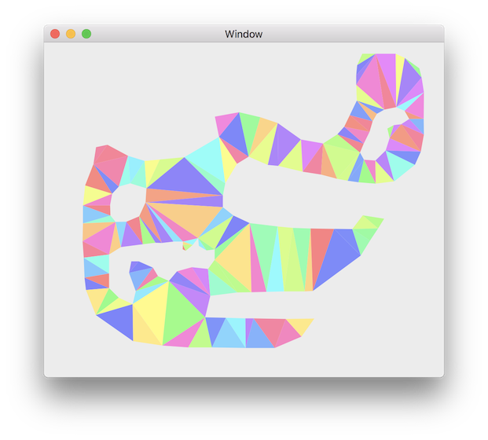
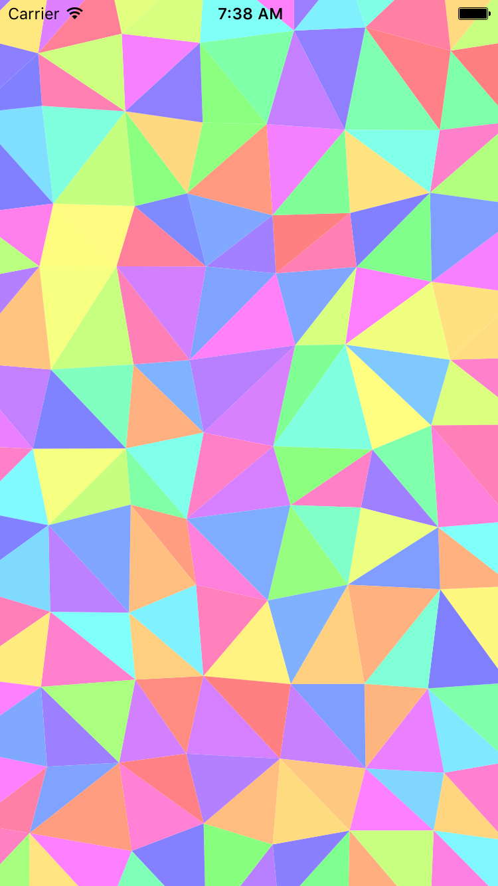

# Delaunay Triangulation
Delaunay Triangulation implementation written in swift [https://en.wikipedia.org/wiki/Delaunay_triangulation](https://en.wikipedia.org/wiki/Delaunay_triangulation)

---

### Usage

Create array of `Vertex`. 
For `CDT` vertices should be sorted and validated. I.e. sorted into polygon. 
Duplicates will be deleted inside of algorithm.
By default `index` of `Vertex` is `-1`. For `CDT` index should be set in order. 

#### Constrained Delaunay Triangulation

`let triangles = CDT().triangulate(vertices, holes)`

Constrained Delaunay Triangulation implemented in the way its utilize Delaunay and then remove trianles for holes and triangles out of constraines. Future improvements can by applied test triangles before adding them to list in original Delaunay triangulation process.

#### Simple Delauney
Generate a set of vertices and pass them into `Delaunay().triangulate(vertices)` which will then return the optimal set of triangles.

See the example project for more details.

